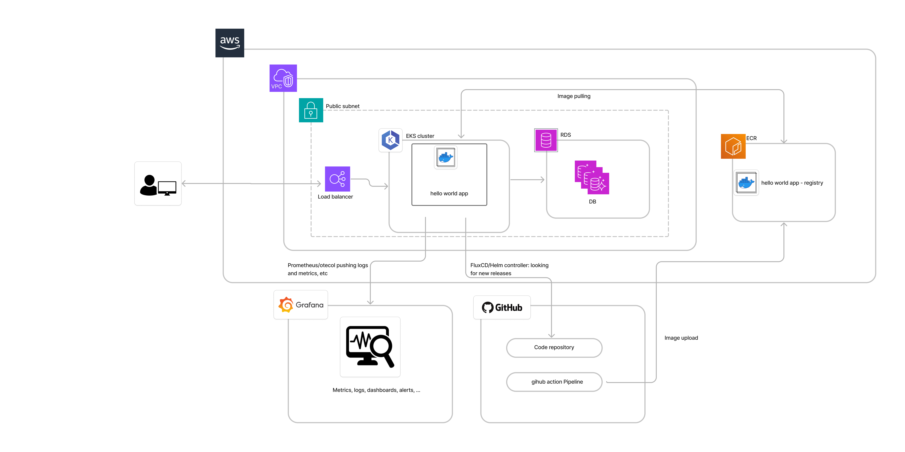

# Local setup

## Raw setup

Clone repo:
```
git clone https://github.com/dtdom/rev-hello-world.git
cd rev-hello-world

```

Create a virtual environment and activate it:
```
python3 -m venv venv
source venv/bin/activate
```
Install the dependencies:
```
pip install -r requirements.txt
```

Run the app:
```
flask run
```

## Docker setup

Build the image:
```
docker build -t rev-hello-world .
``` 

Run the image:
```
docker run -p 5000:5000 rev-hello-world
``` 

# Cloud setup

This solution has been designed to be deployed in a K8s cluster. 
This cluster should have at least the following components:

- Load balancer controller
- Helm controller
- Prometheus operator

For the remote deployment, it also expects a database to be available.

## Behaviour
1. When you push code to the main branch of the Git repository, the following automated process begins:
2. The GitHub Actions Pipeline get executed:
    1. Checkout and python setup
    2. Lint Code
    3. Run Tests: The code is tested using unittest.
    4. Build the imnage with buildx or kaniko, etc
    5. Push image to ECR.
3. FluxCD:
    1. When a change is detected (e.g., a new Docker image), FluxCD updates the Kubernetes cluster with the new manifests.
    2. The updated Docker image is deployed to the Kubernetes cluster.


# Cloud arch diagram




# Next steps

Install Vault operator to manage the secrets in the cluster.

We may discuss if one environment is enough or if we need to have a staging environment, etc.

The pipeline should be improved to include more tests and checks. Using SCA and SAST tools would be a good idea.